# Data Augmentation using Synthetic Images

This study focuses on the area of Computer Vision, and therefore, we focus on the use of images and classification problems related to them. We propose the generation of synthetic data through modern generative Artificial Intelligence (AI) techniques for images, such as diffusion models, as an alternative to conventional Data Augmentation techniques. We find that models trained in a combination of both types of data, real and synthetic, can achieve better performance to models trained only in real data. This suggests that synthetic data can be a valuable tool for improving the performance of machine learning models for computer vision tasks. We chose GANs, PGGAN, and DMs for this study due to their proven effectiveness in generating high-quality synthetic images.

This repository contains the code, notebooks, and model weights used in our study on synthetic data generation for improving the performance of Machine Learning (ML) models in the field of Computer Vision.

## Code and Notebooks
Here you will find the code and notebooks implementing the Generative Adversarial Networks (GANs), Progressive Growing of Generative Adversarial Networks (PGGAN), and Diffusion Models (DMs) techniques used in our study. We used diffusion models in various ways including Stable Diffusion v1.5, Stable Diffusion v2, Dreambooth, LoRa, and XL. Each of these models has its unique strengths in generating synthetic images, which we leveraged to improve the performance of our ML models.

- [Generative Adversarial Networks (GANs)](**)
- [Progressive Growing of Generative Adversarial Networks (PGGAN)](**)
- [Diffusion Models (DMs)](**)

## Datasets
We used the following datasets in our study:

- [Chongqing Pneumoconiosis Detection](https://www.ncbi.nlm.nih.gov/pmc/articles/PMC8431598/)
- [NIH Chest X-rays](https://arxiv.org/abs/1705.02315)
- [Human Brain MRI](https://www.kaggle.com/datasets/masoudnickparvar/brain-tumor-mri-dataset)
- [Diabetic Retinopathy Gaussian Filtered](https://www.kaggle.com/datasets/sovitrath/diabetic-retinopathy-224x224-gaussian-filtered)

Below are some sample images from each dataset:

|         | Image1 | Image2 | Image3 |
|:-------:|:------:|:------:|:------:|
| Chongqing Pneumoconiosis Detection | 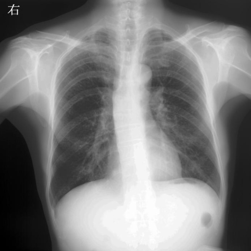 | 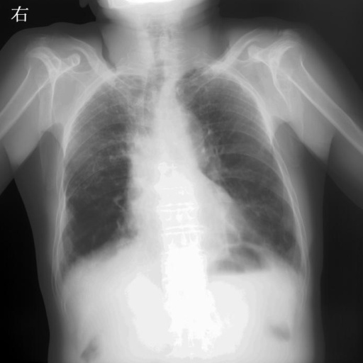 | 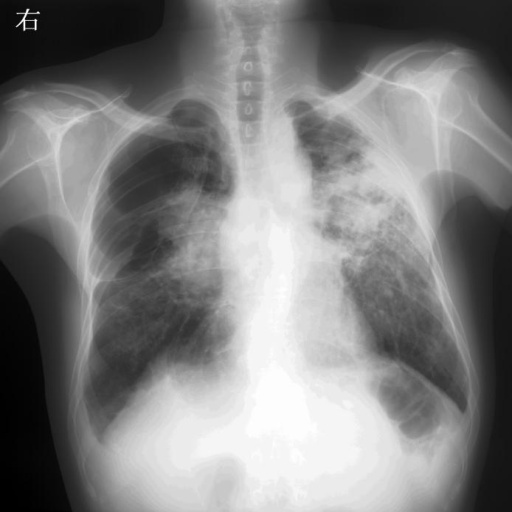 |
| NIH Chest X-rays | 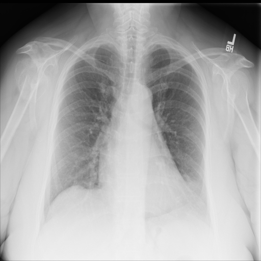 | 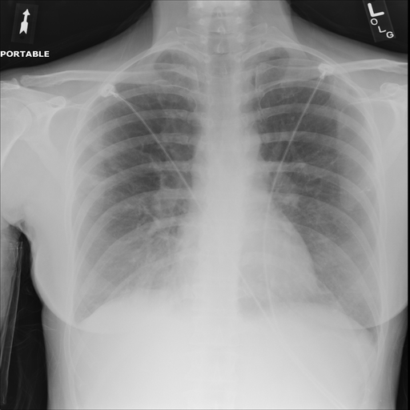 | 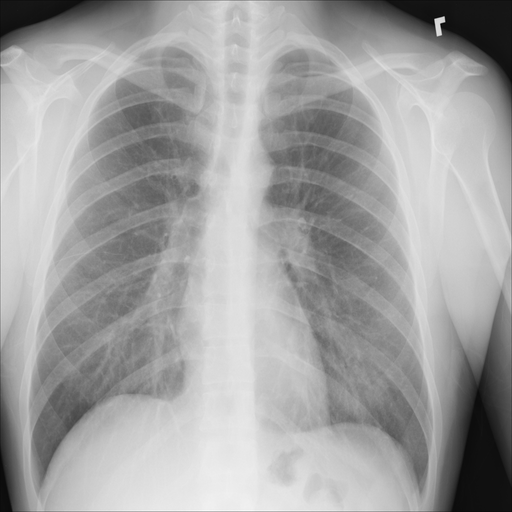 |
| Human Brain MRI | 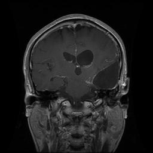 | 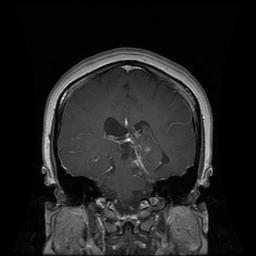 | 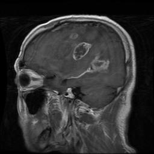 |
| Diabetic Retinopathy Gaussian Filtered | 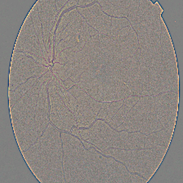 | 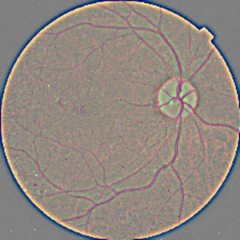 | 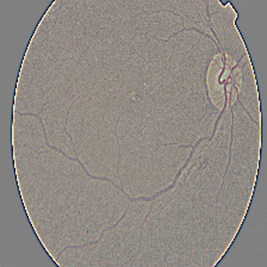 |

## Model Weights
The weights of the models trained during our study are available for download at the following links. Each link corresponds to a specific dataset used in our study. We also provide the performance of each model on its respective dataset.

| Model | Dataset | Training Steps |  Performance | Link |
|-------|---------|----------------|-------------|------|
| GANs  | Chongqing Pneumoconiosis Detection| ** | *Performance* | [**](#) |
| PGGAN | Chongqing Pneumoconiosis Detection| ** | *Performance* | [**](#) |
| DMs   | Chongqing Pneumoconiosis Detection| ** | *Performance* | [**](#) |

## Clustering Code
To manage the diversity of images within each dataset, we devised a solution that involves extracting features from each image, grouping images into clusters based on feature similarity, selecting representative images from each cluster based on specific criteria, and generating synthetic images for each cluster separately. The code for this process can be found in the [Clustering section of the repository](**).
